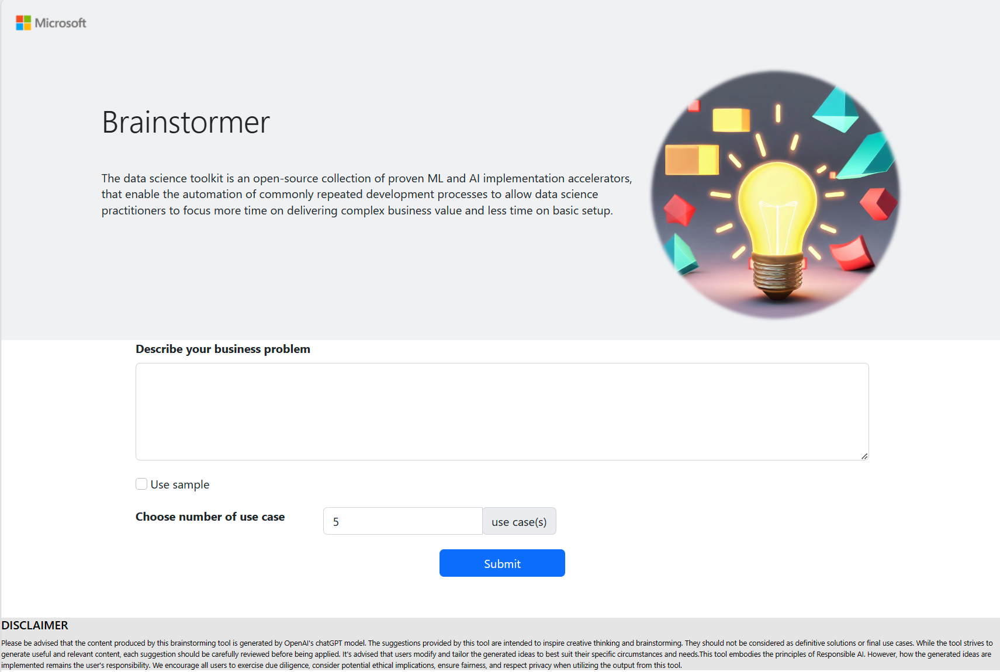
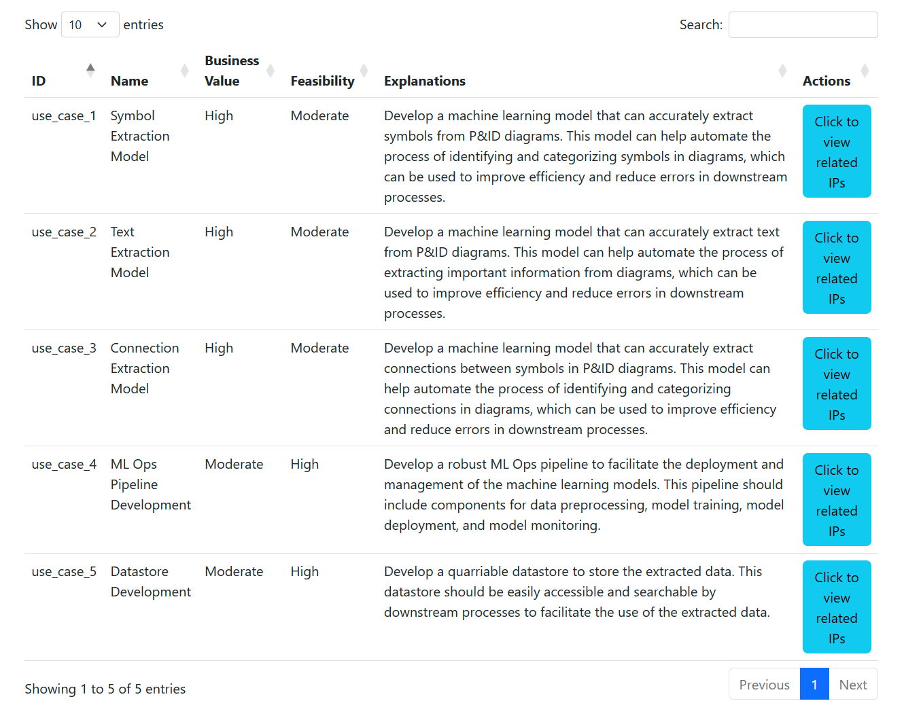
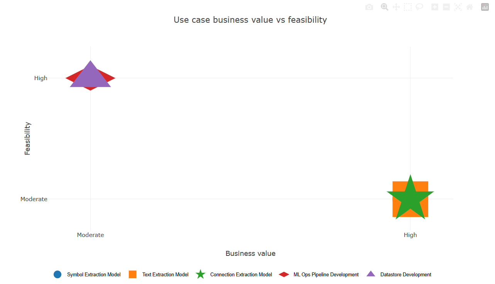
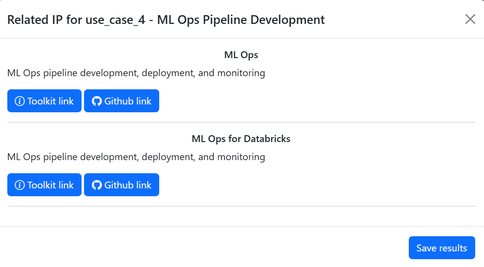

# Brainstormer
During envisioning workshops, data scientists, specialist and sales teams often grapple with translating client-specific business challenges into actionable use cases. Traditionally, the use cases are usually brainstormed by a group of people. After some actionable use cases are prioritized and identified, the users may try to find existing solutions by searching IPs in some database like [DSToolkit](https://www.ds-toolkit.com/) to help developing the solutions.
This project is exploring the potential to leverage the power of large language model (LLM) like ChatGPT to assistant the Brainstorming experience, prioritize use cases in terms of feasibility and business value, and link the brainstormed use cases with related reusable IP in DSToolkit. 

# Demo
The demo can be found [HERE](https://aca-brainstormer-demo-dev--release-8-7-23.jollywave-1d2713db.westeurope.azurecontainerapps.io/
)

## Landing Page
The user can configurate number of use cases and try sample business problems by ticking use sample. It will prefill "Describe your business problem" with one of the random sample problem. Here is a screenshot of the landing page.



## Brainstormed Use Cases
After submitting the business problem, the table of brainstormed use cases and their descriptions will shown, together with the evaluations in terms of feasibillity and business values. Here is a screenshot of an example result.



## Business Value vs. Feasibility figure
Here is an example output figure. The user can hover on the use cases to show the name of use cases, copy or download it.



## Related IPs in DSToolkit
Here is an example related IPs from DSToolkit. The user can click the links to the correponding webpages of the IP and download the results to copy and paste into a LLM chat portal to continue the conversation.




# What is Invovled in Brainstormer Code Repo
Brainstormer is Azure OpenAI models based brainstorming assistant tool, specifically for data scientists, specialists and sales teams. Its primary function is to facilitate the brainstorming of use cases from diverse client business problems. Furthermore, it evaluates these use cases in terms of feasibility and the potential business value they bring with visuallizations. For each use case, the Brainstormer will recommend relevant IPs from DSToolkit. With the integration of a new natural language processing interaction, the tool helps to enhance the search experience within DSToolkit. Its overarching aim is to streamline the brainstorming process for data scientists, specialists and sales teams and increase the rate of IP reuse. The base code with embedding search can also be extended in other knowledge base aside from [DSToolkit](https://www.ds-toolkit.com/).

## Ideation
Ideation component takes the business problem input by user, leverage Azure OpenAI models to generate use cases, and rank these use cases in terms feasibility ((high, moderate, low)) and business values (high, moderate, low). Below is the JSON format of the returned use cases.
```json
Dict: expect gpt return a json format object in the following format
{
    "status": status_code (Success or Fail),
    "results": {
    "use_case_1":{
        "use_case_name": xxx,
        "explanations": xxx,
        "business_value": xxx,
        "feasibility": xxx
    }
}
}
```

## Recommend IPs
Recommendation component takes a specific use case as input and recommend related IPs. The embeddings of description of existing IPs are generated by calling into Azure OpenAI text-embedding-ada-002 model in advance. The embedding of the use case is generated. Then cosine similarity is calucated and the top three existing IPs with highest scores are selected as candidated. To avoid the similarity from the text style instead of content, we leverage gpt-35-turbo to refine the selected IPs to rule out any irrelevant ones. Below is the JSON format of the returned related IPs.
```json
Dict: {
    "status": status_code,
    "results":  [
        {
"ip_id": xxx,
"usage": "xxxx",
"url": "xxxxxx",
"ip_title": "xxx"
    }
    ]
}
```

## Frontend
Flask is used as the frontend framework. A table is created to organized the brainstormed use cases and a figure is created to visualize the ranking of use cases in terms of feasibility and business value.

# Getting Started
To get the code up and running, follow the following steps:
- Set up the development environment
- Use the flask UI

## Set up the development environment
1. Clone the repository
   ```bash
   git clone <Repo_URL>
   cd Brainstormer
   ```
1. Create a virtual environment
   ```bash
   conda create -n brainstormer-env python=3.8.16
   conda activate brainstormer-env
   ```
1. Install the required packages
   ```bash
   pip install -r environment/requirements.txt
   ```
   - [optional] Setup Jupytext and Pre-commit hook if you prefer to use them.
     Commit `ipynb` format is prohibited.
1. Set the FLASK_APP to the python main program app.py
    ```bash
    set FLASK_APP=app.py
    ```
1. Change open AI to your endpoint in `app.py`
2. Set environment variable with open ai keys
    ```bash
    set OPENAI_API_KEY=<your_key>
    ```

## Use the flask UI
1. Run the flask app
    ```bash
    flask run
    ```
    Use the URL "http://127.0.0.1:5000" in your browser to access the app by the default port of flask: 5000.

2. (Alternatively) Run the flask app with a specific port
    ```bash
    flask run --host=0.0.0.0 --port=8000
    ```
    Wherein, the argument --port=XX  XX= any number of the free port in your PC.
    
    Use the URL "http://127.0.0.1:8000" in your browser to access the app.


# Contact

For more details or help deploying, contact the following:
* [Zachary Hou](zacharyhou@microsoft.com), Microsoft
* [Ricardo Castro](ricardo.castro@microsoft.com), Microsoft
* [Xiaolu Lu](xiaolu.lu@microsoft.com), Microsoft
* [Vy Le](vy.le@microsoft.com), Microsoft
* [Wenwen Wang](wenwenwang@microsoft.com), Microsoft
* [Ryan Rogers](ryanrogers@microsoft.com), Microsoft

# Acknowledgements

This repository is built in part using the following frameworks:
- [Flask](https://pypi.org/project/Flask/)
- [gevent](https://pypi.org/project/gevent/)
- [openai](https://pypi.org/project/openai/)
- [pyarrow](https://pypi.org/project/pyarrow/)
- [pandas](https://pypi.org/project/pandas/)
- [python-dotenv](https://pypi.org/project/python-dotenv/)
- [matplotlib](https://pypi.org/project/matplotlib/)
- [scikit_learn](https://pypi.org/project/scikit-learn/)
- [plotly-express](https://pypi.org/project/plotly-express/)

# Backlogs

- Enable editable tables and figures
- Enable conversations
- Upload long document for business problem description and summarize it as simple business problem 

## Contributing

This project welcomes contributions and suggestions.  Most contributions require you to agree to a
Contributor License Agreement (CLA) declaring that you have the right to, and actually do, grant us
the rights to use your contribution. For details, visit https://cla.opensource.microsoft.com.

When you submit a pull request, a CLA bot will automatically determine whether you need to provide
a CLA and decorate the PR appropriately (e.g., status check, comment). Simply follow the instructions
provided by the bot. You will only need to do this once across all repos using our CLA.

This project has adopted the [Microsoft Open Source Code of Conduct](https://opensource.microsoft.com/codeofconduct/).
For more information see the [Code of Conduct FAQ](https://opensource.microsoft.com/codeofconduct/faq/) or
contact [opencode@microsoft.com](mailto:opencode@microsoft.com) with any additional questions or comments.

## Trademarks

This project may contain trademarks or logos for projects, products, or services. Authorized use of Microsoft 
trademarks or logos is subject to and must follow 
[Microsoft's Trademark & Brand Guidelines](https://www.microsoft.com/en-us/legal/intellectualproperty/trademarks/usage/general).
Use of Microsoft trademarks or logos in modified versions of this project must not cause confusion or imply Microsoft sponsorship.
Any use of third-party trademarks or logos are subject to those third-party's policies.